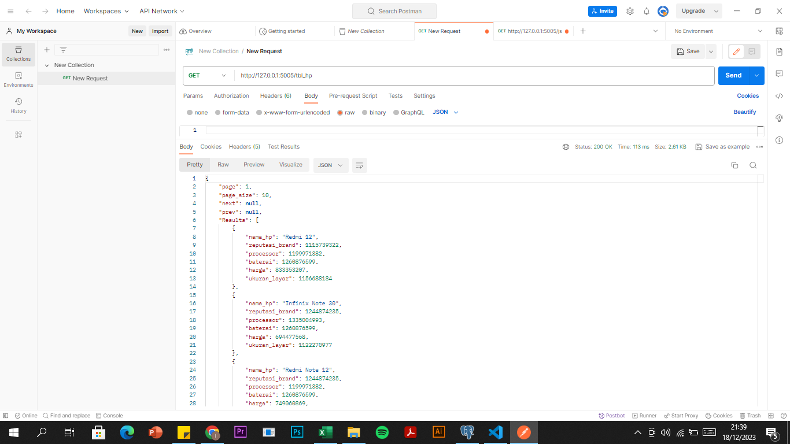
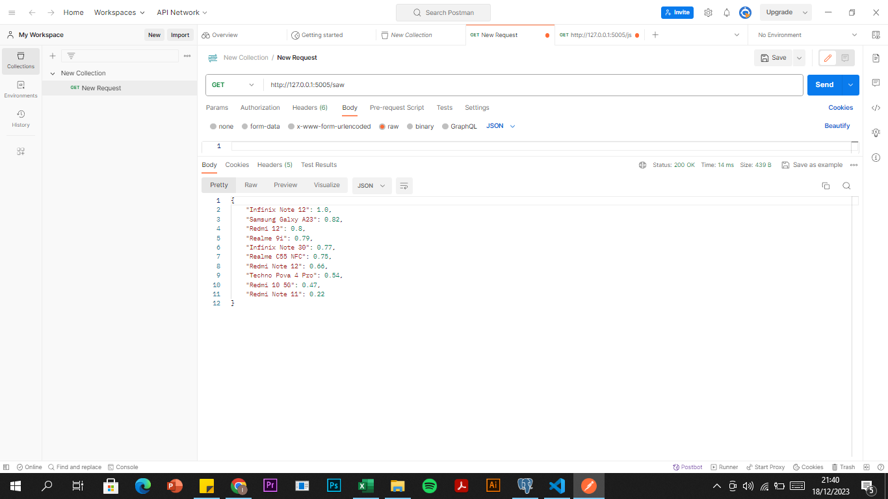
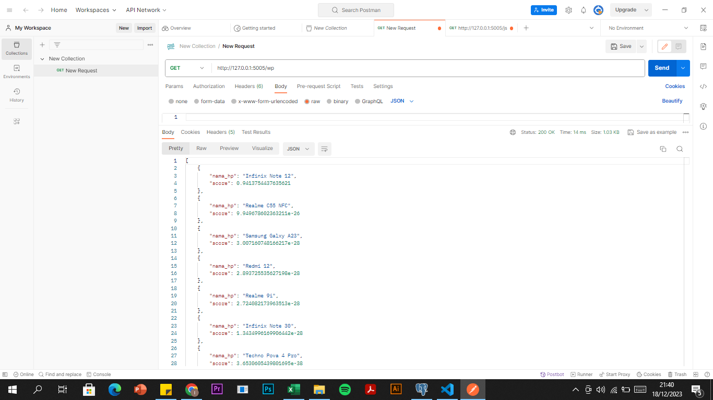
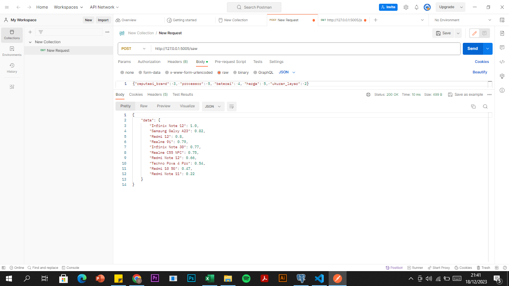
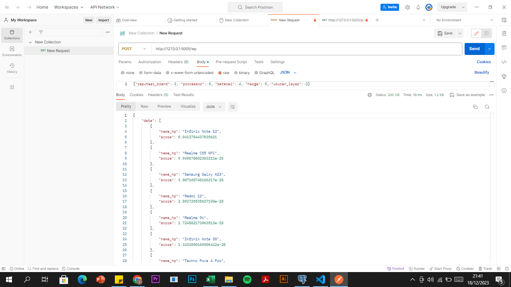

# spk_web
## Install, create and activate virtualenv
https://medium.com/analytics-vidhya/virtual-environment-6ad5d9b6af59

## Install requirements

    pip install -r requirements.txt

## Run the app
to run the web app simply  use

    python main.py

## Usage
Install postman 
https://www.postman.com/downloads/

get HP list

get recommendations saw list

get recommendations wp

ref:
https://en.wikipedia.org/wiki/Pearson_correlation_coefficient

### TUGAS UAS
Implementasikan model yang sudah anda buat ke dalam web api dengan http method `POST`, contoh implemantasinya dapat dilihat pada repositori ini untuk api recommendation, 

INPUT:
{
	"reputasi_brand": 3, 
	"processor": 5, 
	"baterai": 4, 
	"harga": 5, 
	"ukuran_layar": 2
}

OUTPUT (diurutkan / sort dari yang terbesar ke yang terkecil):

post recommendations saw

post recommendations wp
